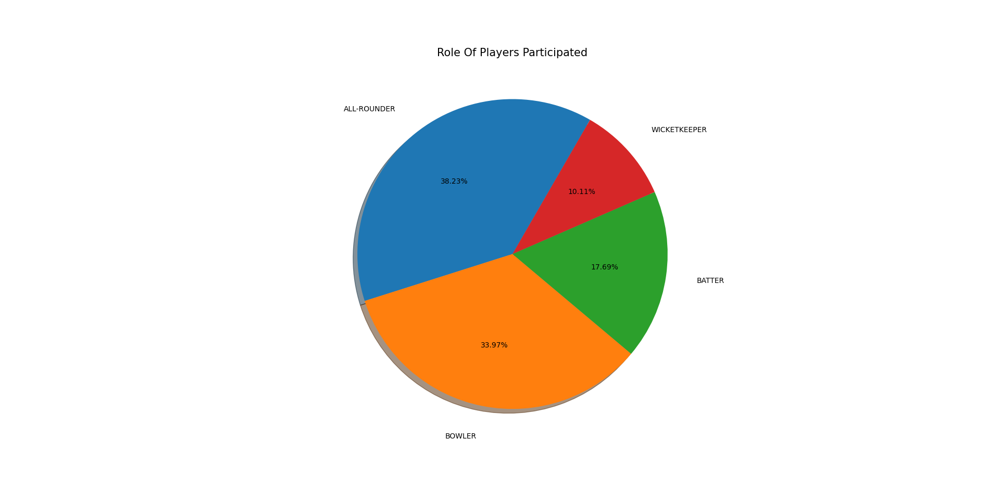
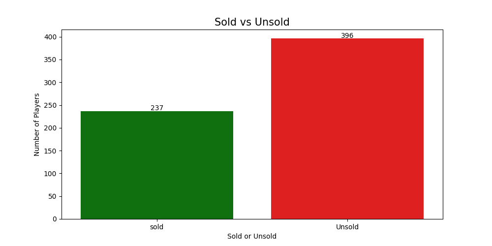
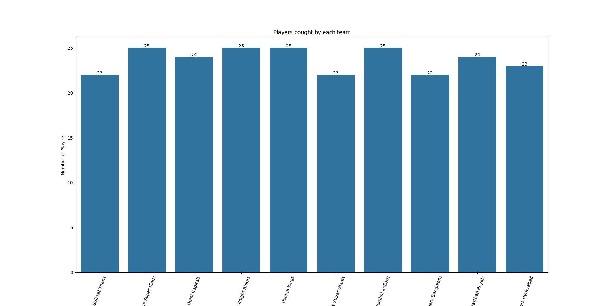
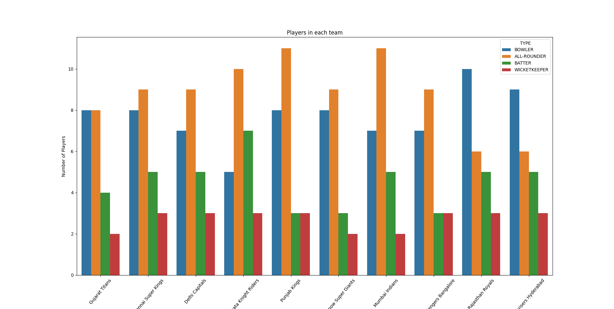

# IPL 2022 Auction Data Analysis

## Project Overview

This project performs Exploratory Data Analysis (EDA) on the IPL 2022 Auction dataset using Python.

The project focuses on cleaning the dataset, handling missing values, analyzing player auction details, and creating visualizations to understand different aspects of the IPL 2022 Auction.

---

## Objectives

- Understand the IPL 2022 Auction dataset.
- Clean the dataset by handling missing values.
- Analyze player categories and auction results.
- Compare sold and unsold players.
- Analyze team-wise player distribution.
- Identify important insights from the auction data.

---

## Technologies Used

- Python
- Pandas
- NumPy
- Matplotlib
- Seaborn

---

## Dataset

Dataset used:

- `ipl_2022_dataset.csv`

---

## Data Preprocessing

The following preprocessing steps were performed:

- Loaded the IPL 2022 Auction dataset.
- Checked dataset shape and column information.
- Removed the unnecessary `Unnamed: 0` column.
- Checked missing values in the dataset.
- Replaced missing values in:
  - `COST IN ₹ (CR.)`
  - `Cost IN $ (000)`
- Replaced missing values in `2021 Squad` with **Not Participated**.
- Created a new **status** column to identify Sold and Unsold players.
- Renamed the `2021 Squad` column to `Prev_team`.
- Created additional columns:
  - `retention`
  - `base_price`
  - `base_price_unit`

---

## Analysis Performed

The project includes the following analyses:

- Checked dataset information.
- Checked column names.
- Checked missing values.
- Identified duplicate player names.
- Counted the number of players in each category.
- Compared Sold and Unsold players.
- Counted players bought by each IPL team.
- Analyzed retained players and auction players.
- Found the Top 5 highest-paid bowlers.
- Identified players who played in IPL 2021 but remained unsold in IPL 2022.

---
## Visualizations

### 1. Role of Players Participated

This pie chart shows the percentage of different player roles.



---

### 2. Sold vs Unsold Players

This bar chart compares the number of sold and unsold players.



---

### 3. Players Bought by Each Team

This chart shows how many players each IPL team purchased during the auction.



---

### 4. Players in Each Team

This chart shows the distribution of different player roles in each IPL team.



---

## Output

The project also displays:

- Top 5 highest-paid bowlers.
- Players who played in IPL 2021 but remained unsold in IPL 2022.


---

## How to Run

### 1. Clone the repository

```bash
git clone https://github.com/AKHIL-MARADANA/IPL-Auction-Data-Analysis.git
```

### 2. Move into the project folder

```bash
cd IPL-Auction-Data-Analysis
```

### 3. Install the required libraries

```bash
pip install -r requirements.txt
```

### 4. Run the Python program

```bash
python ipl_match_result.py
```

---

## Requirements

The project uses the following Python libraries:

- pandas
- numpy
- matplotlib
- seaborn

You can install them using:

```bash
pip install -r requirements.txt
```

---

## Future Improvements

Some features that can be added in the future:

- Team-wise spending analysis.
- Highest-paid player from each team.
- Interactive dashboards using Plotly.
- More auction statistics.
- Additional player comparison charts.

---

## Author

**Akhil Maradana**

GitHub: https://github.com/AKHIL-MARADANA